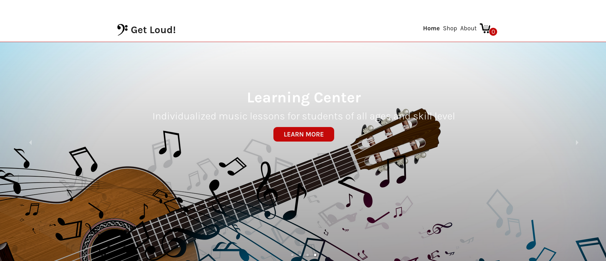
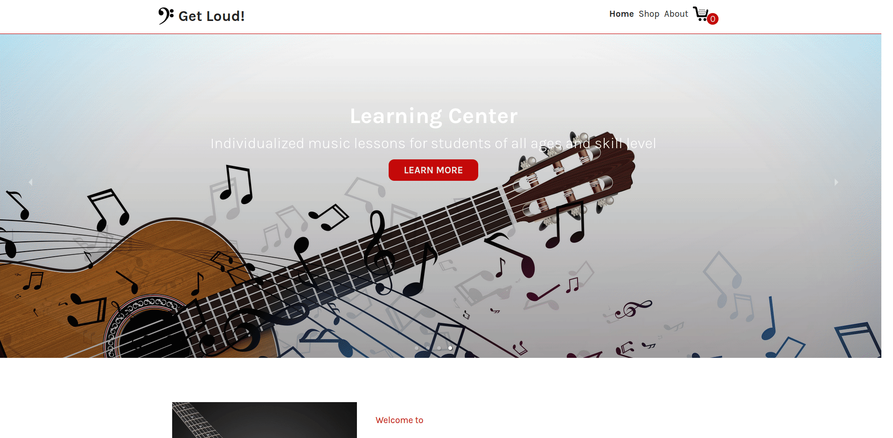

# Shoping Cart

A mock single page application demonstrating shopping cart functionality. The site is made using React and React Router. See it live [here](https://bofmar.github.io/shoping-cart).

## How to Use

The site consists of four main pages: Home, Shop, About and Checkout. Navigating to these is done via the top navbar.
* On the home screen the user can see a presentation of the fictional company's profucts and services and can navigate to the About page or the Shop page by clicking the appropriate buttons.
* On the Shop screen the user can browse the products in offer, witch are divided in four categories: Guitars, Amplifiers, Pedals/Effects and Accessories. By clicking on a product the user is navigated to the specific product's page.
* On said product page the user can add the product to his cart, or navigate back to some other part of the website. Adding a product to the cart will update the counter next to the cart icon in the top right.
* The About page is a mock page that presents the various services via Lorem Ipsum text.
* On the Checkout page, the user can review their order and see the grand total of their purchase. They can also remove products from their cart, witch updates all the relevant fields. The Complete Your Purchase button is disabled.
* If the user goes to checkout without any items in their cart they will see text that informs them that their cart is empty and a button that prompts them to go to the Shop page.

## Demo

## Credits

* The carousel on the home page uses [React Responsive Carousel](https://www.npmjs.com/package/react-responsive-carousel).

* React testing library was used for the automated tests.